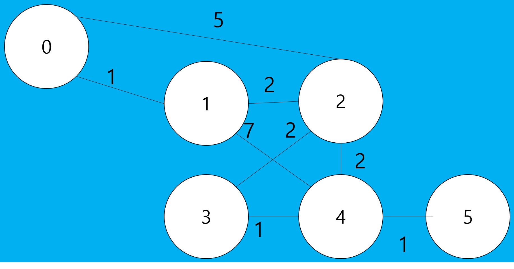
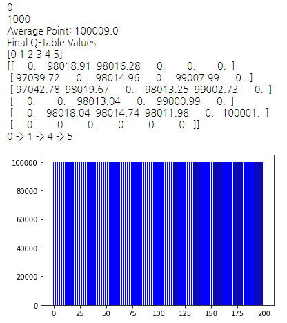
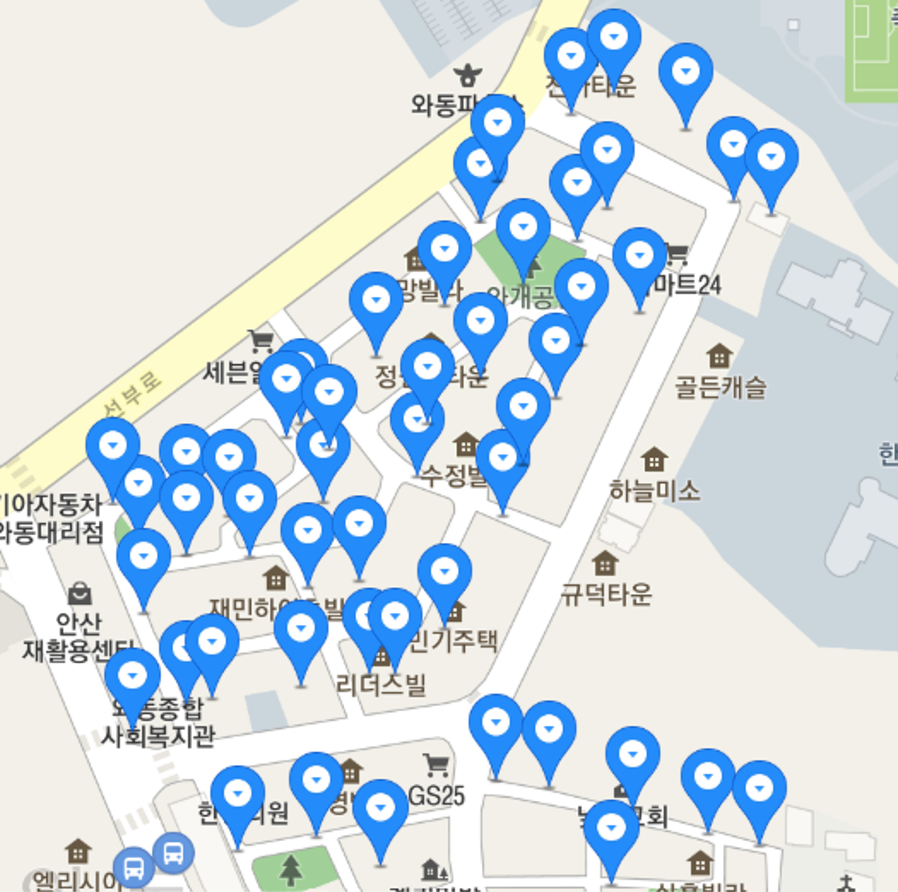
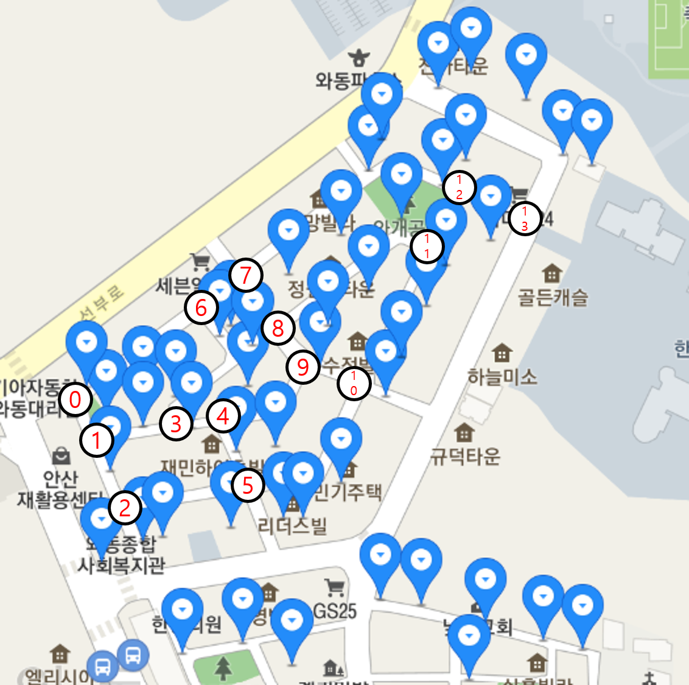
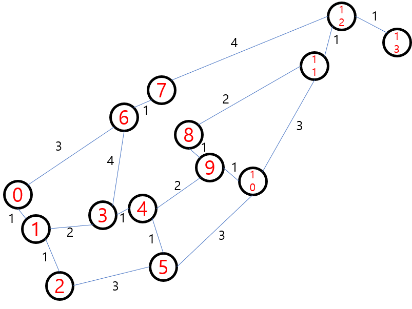
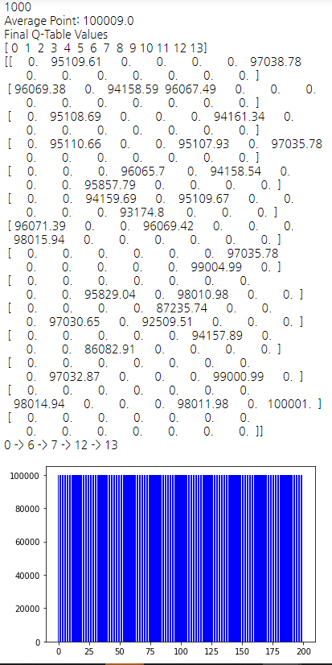
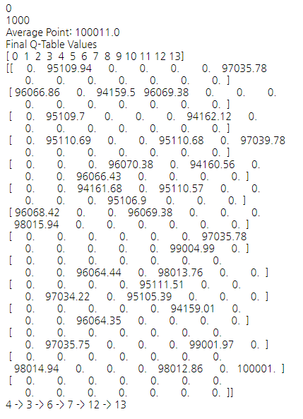

# 이게 뭐지?

강화학습에서 Q-Learning의 대표적인 예제인 FrozenLake에서 영감을 받아
Q-Learning을 통해 그래프 구조에서 가장 높은 reward를 받는 경로를 찾을 수 있을 지 생각해보았다.

1학년 2학기 때 동아리 시간에 강화학습을 공부하면서 해보았다.

이렇게 막 만든 그래프가 있다.
0번 노드에서 5번 노드까지 이동하는데,
다른 노드들을 최대한 적게 방문하면서 간선에 적혀있는 reward를 최대화 하려고 한다.

> 노드를 방문할 때
처음 방문하는 노드면 reward를 해당 간선의 reward로 하고,

> 이미 방문했던 노드면 reward를 0으로 하고 해당 episode를 종료한다.

> 만약 방문하는 노드가 도착지 노드라면 reward를 100000으로 하고 해당 episode를 종료한다. 

라는 알고리즘을 생각하고 짜보았다.

예상한대로 0->1->4->5 순서대로 나왔다.

나는 이걸 어디에 써먹을 수 있을 지 생각보았고, 
한번 학교 주변에 가로등 개수를 세서 특정 위치에서 학교까지 등교하는 길 중 짧으며 밝은(가로등 개수가 많은) 길을 찾아보았다.

이는 공공데이터에서 가로등을 표시해준 것이다.

노드를 정하고

주변의 가로등 개수를 reward로 하는 그래프를 완성한다.

0번 노드에서 13번 노드로 가는 경로를 구해보니 이렇게 나왔다.
> 0->6->7->12->13

결국 가장 최단 경로를 구해버렸다.

이번엔 4번에서 13번 노드로 가는 경로를 구해보았다.

4에서 13으로 가는 최단 경로(노드를 가장 적게 거치는 경로)는 목적지를 제외하고 총 4개의 노드를 더 거쳐야 하는데, 그 최단 경로들 중에서도 가장 reward가 높은 길을 택해서 간 것을 알 수 있다.

(사실 노드를 잡을 때 길이 만나는 곳을 기준으로 잡았기 때문에 노드 간 실제 거리는 각각 달라서 현실과는 다를 수 있다)

## 결론

다른 기존의 그래프 알고리즘보다 효율적이라고 말하기는 어려울 것 같다.ㅋㅋ

하지만 Q-Learning 으로 뭐라도 만들어봤다는 것에 의의를 둔다..

